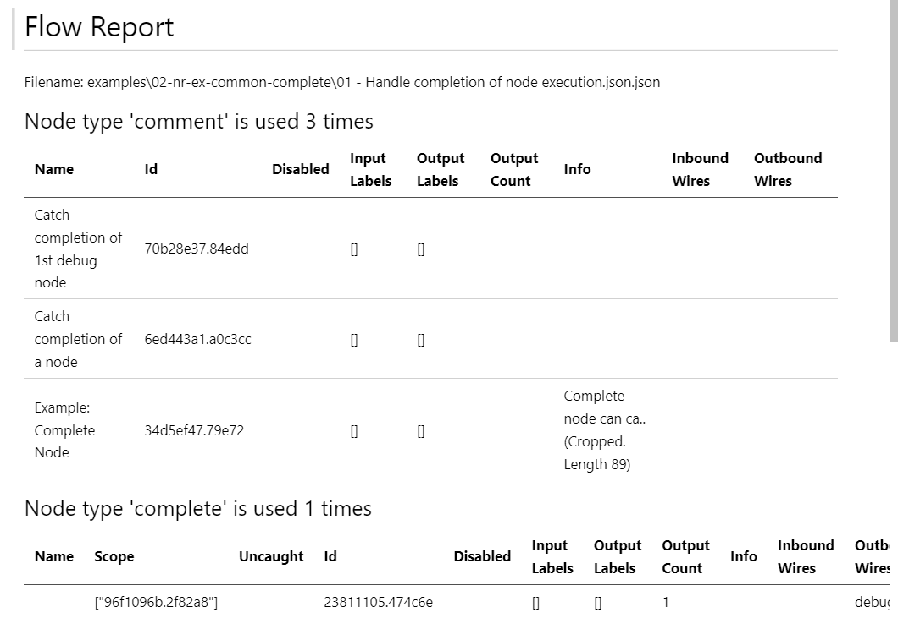

# Node-RED - Flow Report

Make [NodeRED](https://node-red.org) flows easier to read and easier to compare versions in Version Control tools like git

<table border='solid 1px'><tr><td>
    
</td><td></table>

The Node-RED Flow Report is using the [Node-RED Flow Parser](https://github.com/node-red/flow-parser)

## Quick start 

### Using Git
(until more advanced ways...)

    git clone https://github.com/scaletronic/node-red-flow-reporter/
    cd node-red-flow-reporter/
    npm run ts-cli -- "examples\02-nr-ex-common-complete\01 - Handle completion of node execution.json"

And then the Flow Reporter will create

    examples\02-nr-ex-common-complete\01 - Handle completion of node execution.json.md

